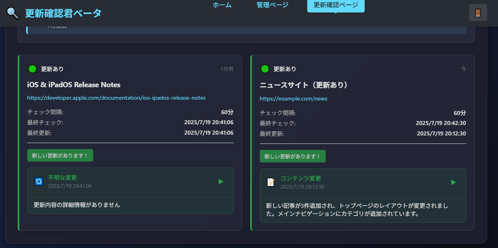
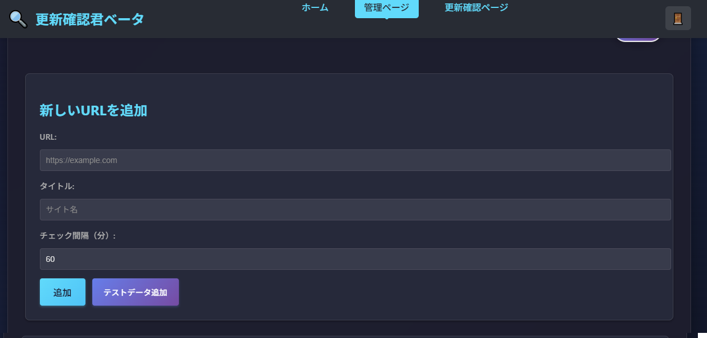
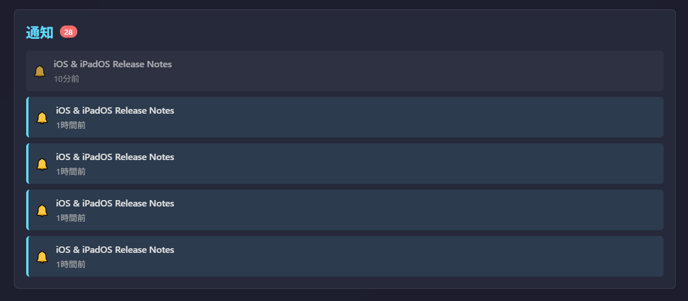

# 更新確認君ベータ

React 19ベースのWebサイト更新監視アプリケーション。指定したURLの更新を自動で確認し、変更があった場合に通知します。

## 主な機能

- **URL監視**: 複数のWebサイトのHTMLコンテンツを定期的にチェック
- **更新通知**: コンテンツに変更があった場合に即座に通知
- **詳細表示**: 更新内容の差分を見やすく表示
- **BASIC認証**: 暗号化されたパスワード認証システム
- **データ永続化**: ローカルストレージで設定やログを保存
- **レスポンシブデザイン**: モバイル・デスクトップ対応

## スクリーンショット

### 🔍 監視ダッシュボード


*登録されたURLの更新状況をリアルタイムで確認。フィルタリングや並び替え機能も搭載。*

### ⚙️ URL管理ページ  


*新しいURLの追加と既存URLの管理。チェック間隔やパスワード変更も可能。*

### 🔔 更新通知


*更新検出時のポップアップ通知とキャラクターによる状況表示。*

## 技術スタック

- **Frontend**: React 19.1.0 + TypeScript
- **Routing**: React Router v7
- **Storage**: localStorage (SSR-safe)
- **Crypto**: Web Crypto API (SHA-256 + AES-GCM)
- **Build**: Create React App
- **Deploy**: Vercel

## 開発環境のセットアップ

### 前提条件
- Node.js 16.x 以上
- npm または yarn

### インストール
```bash
npm install
```

### 環境変数
```bash
cp .env.example .env
```

### 開発サーバー起動
```bash
npm start
```

ブラウザで `http://localhost:3000` にアクセス

## Vercelデプロイ

### 自動デプロイ（推奨）
1. GitHubリポジトリにプッシュ
2. Vercelダッシュボードでリポジトリを連携
3. 自動ビルド・デプロイが開始

### 手動デプロイ
```bash
# Vercel CLIインストール
npm i -g vercel

# プロジェクトルートでデプロイ
vercel

# 本番環境にデプロイ
vercel --prod
```

### Vercel設定

プロジェクトには以下の設定ファイルが含まれています：

- `vercel.json`: SPA ルーティング、セキュリティヘッダー
- `.env.production`: 本番環境変数
- `public/_redirects`: フォールバックルーティング

### 環境変数設定

Vercelダッシュボードで以下を設定：

```
REACT_APP_ENVIRONMENT=production
REACT_APP_VERSION=1.0.0
GENERATE_SOURCEMAP=false
```

## プロジェクト構造

```
src/
├── components/          # 共通コンポーネント
│   ├── Login.tsx       # 認証コンポーネント
│   ├── MonitorCharacter.tsx  # 監視キャラクター
│   ├── Popup.tsx       # ポップアップ通知
│   ├── ProtectedRoute.tsx    # ルート保護
│   └── UpdateSummary.tsx     # 更新内容表示
├── contexts/           # Reactコンテキスト
│   └── AuthContext.tsx # 認証状態管理
├── pages/             # ページコンポーネント
│   ├── Admin.tsx      # 管理ページ
│   ├── Monitor.tsx    # 監視ページ
│   └── NotFound.tsx   # 404ページ
├── types/             # TypeScript型定義
│   └── index.ts
├── utils/             # ユーティリティ
│   ├── crypto.ts      # 暗号化機能
│   └── storage.ts     # ストレージ操作
└── App.tsx            # メインアプリ
```

## セキュリティ機能

### パスワード認証
- SHA-256ハッシュ化（ソルト付き）
- AES-GCM暗号化でデータ保護
- パスワード強度チェック

### セキュリティヘッダー
- Content Security Policy (CSP)
- X-Frame-Options
- X-Content-Type-Options

## 使用方法

### 初回セットアップ
1. アプリケーションにアクセス
2. 管理者パスワードを設定（8文字以上）
3. ログイン

### URL監視設定
1. 管理ページで「URLを追加」
2. 監視したいURLと名前を入力
3. 保存

### 更新確認
1. 監視ページで一覧表示
2. 「すべて確認」または個別チェック
3. 更新があれば通知とログに記録

## ビルド

```bash
# 本番ビルド
npm run build

# ビルドファイルをローカルで確認
npm run serve
```

## ライセンス

Private Project

## 作成者

Update Checker Beta Team
